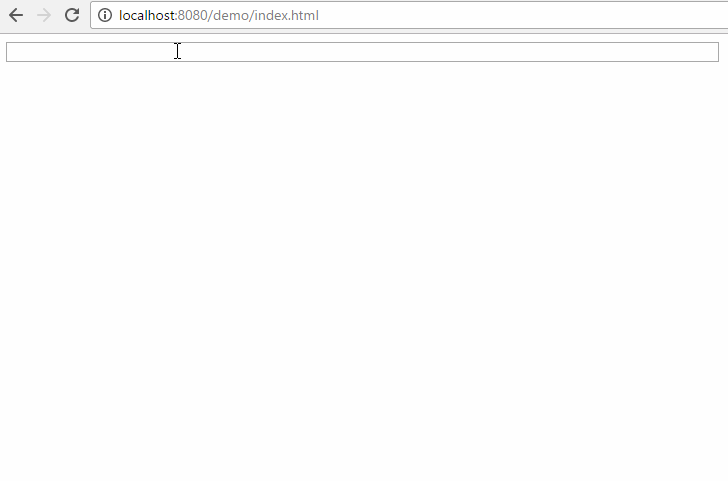

[](https://www.npmjs.com/package/cache-autocomplete)
[](https://www.npmjs.com/package/cache-autocomplete)
# Cache-AutoComplete
#### Probably not what you're looking for, but it works for me :stuck_out_tongue: :poop:

### Minified = *15.3b*  .min gzipped = *5.38kb*



### Explanation
I needed a simple auto complete component for a web app that supported keyboard navigation.
I wanted something light weight and flexible.
After searching around, nothing fit my use case or desire. The component
defaults to Material Design-like styling. This is customizable by setting `itemClass` and `listClass` when creating the component. PRs welcome to improve functionality.
Just want to keep this light weight :smile:


### Installation
`npm install cache-autocomplete`

### Usage
`cacheautocomplete` is exposed as a library thanks to Webpack so using a `<script>` tag on your html will work. You can also import/require what you need using the module if you're using a module loader for your app.
### JS
```js
var rootInput = document.getElementById("myAutoComplete");
var CACompleteOptions = {
            rootElement: rootInput, // required - the dom element to tie into
            queryUrl: 'https://api.test.com/api/customer/typeahead?name={{ value }}&apikey=84', // required and must use the `{{ value }}` to inject the rootElement's current value when typing
            itemTemplate: '<p> {{ Name }} </p>', // required
            minStringLength: 2, // default is 1
            cache: false, // default is true
            listClass: 'listClass', // optional
            itemClass: 'itemClass', // optional
            onItemSelect: function (selectedItem) { // optional - callback when an item is selected via keyboard or mouse event
                console.log(selectedItem);
                rootInput.value = selectedItem.SomeProp;
            }
        };

cacheautocomplete.create(autoCompleteOptions);

```

### HTML
```html
<input id="myAutoComplete" type="text" />
```

### Public Methods
- `create(opts: CACompleteOptions)` - create a cache autocomplete using the options object.
- `clearCache(url?: string)` - If a url is specified only that url is removed from storage.
If no url is specified all CacheAutoComplete items are removed from storage.


### CacheAutoCompleteOptions 
```ts
interface CACompleteOptions {
    rootElement: HTMLInputElement; /// The HTML Input element to use as the anchor.
    queryUrl: string; /// The URL to ping for remote data.
    itemTemplate: any; /// The response data Key property to display
    onItemSelect: Function; /// callback function when a list item is selected via keyboard or mouse - this is optional but you likely need to use it and set the rootInput value to some prop in your list objects
    minStringLength?: number; /// optional - default is 1
    cache?: boolean; /// optional - default is true
    listClass?: string; /// css class to style the list
    itemClass?: string; /// css class to style items in the list.
}
```
### Contributing
- `git clone https://github.com/bradmartin/cache-autocomplete.git`
- `npm install` - install deps
- `npm run dev` - will transpile and kick off the webpack dev server
