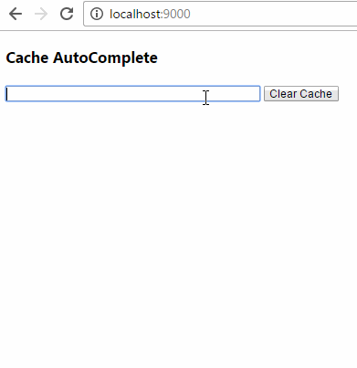

[](https://www.npmjs.com/package/cache-autocomplete)
[](https://www.npmjs.com/package/cache-autocomplete)
# Cache-AutoComplete
### Probably not what you're looking for, but it works for me :stuck_out_tongue: :poop:

### Minified = 3.87kb 
### .min gzipped = 1.39kb



## Explanation
I needed a simple auto complete for a web app I was working on.
After searching around, nothing fit my use case or desire. 
This provides a simple auto complete that caches the response 
from the HTTP request into localStorage. This is optional but utilizing
the cache you remove the network request. Generating the component with
cached data takes on avg. 10ms with 200 items in the data list and avoiding
the network requests.

### Usage


#### CacheAutoCompleteOptions 
```ts
interface CACompleteOptions {
    rootElement: HTMLInputElement;
    cache: boolean;
    queryUrl: string;
    wildCard: string;
    minStringLength: number;
    itemValue: any;
    listClass: string;
    itemClass: string;
    onItemSelect: Function;
    onItemsSet: Function;
}
```
#### HTML
```html
<input id="myAutoComplete" type="text" />
```
#### CSS
```css
.listClass {
    font-family: 'Segoe UI', Tahoma, Geneva, Verdana, sans-serif;
    background-color: #fff;
    border-radius: 0;
    box-shadow: 0 1px 3px 0 rgba(0,0,0,.2), 0 1px 1px 0 rgba(0,0,0,.14), 0 2px 1px -1px rgba(0,0,0,.12);
}
.itemClass {
    color: rgb(33,33,33);
    padding: 6px;
    cursor: pointer;
    text-overflow: ellipsis;
    height: 48px;
    line-height: 48px;
    padding: 0 15px;
    overflow: hidden;
    white-space: nowrap;
    transition: background .15s linear;
    background: transparent;
}
.itemClass:hover {
    background-color: rgb(238,238,238);
}

.itemClass:focus {
    outline: none;
    background-color: #EEEEEE;
    color: #444;
}
```
#### JS
```js
var rootInput = document.getElementById("myAutoComplete");
var CACompleteOptions = {
            rootElement: rootInput,
            cache: true,
            queryUrl: `https://api.test.com/api/customer/typeahead?name=~QUERY&apikey=84`,
            wildCard: `~QUERY`,
            minStringLength: 1,
            listClass: 'listClass',
            itemClass: 'itemClass',
            itemValue: 'CST_Name',
            onItemSelect: function (selectedItem) {
                console.log(selectedItem);
            },
            onItemsSet: function() {
                console.log('on items set');
            }
        };

var caComplete = new CAComplete(autoCompleteOptions);

```
